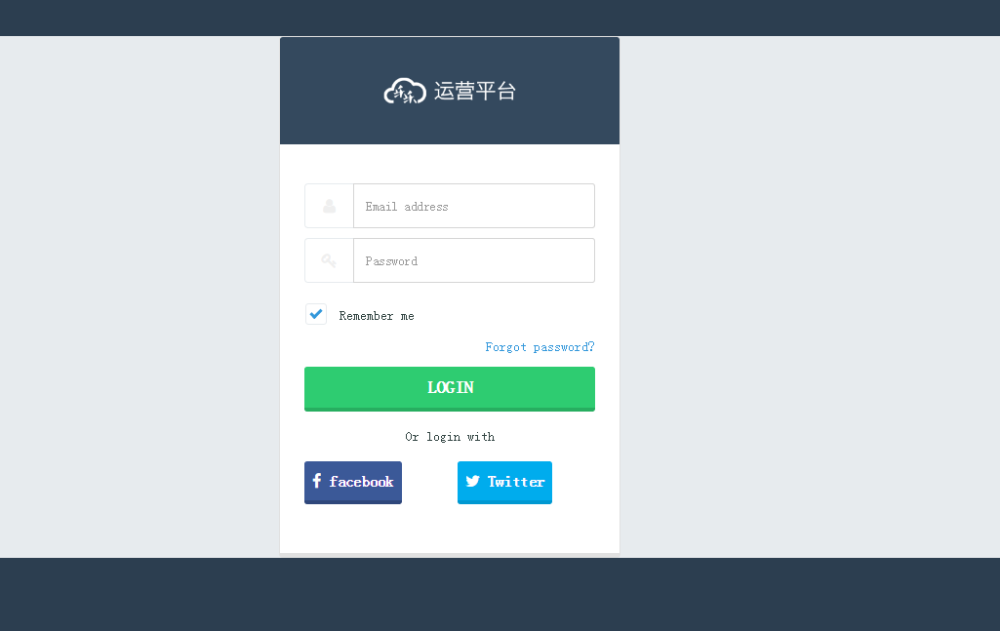
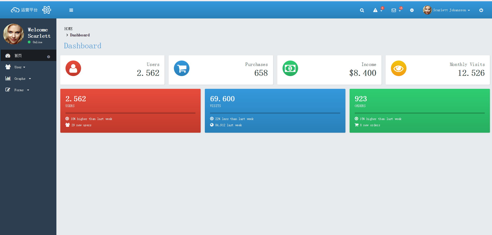
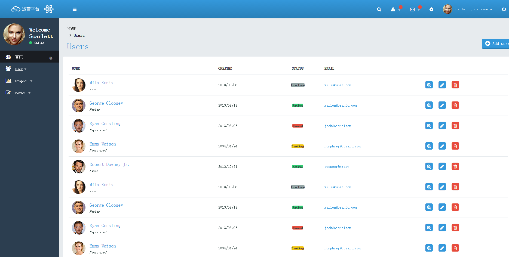

# vue-explorer

> A Vue.js project(2.0.1)

## Build Setup

``` bash
# install dependencies
npm install

# serve with hot reload at localhost:8090
npm run dev

# build for production with minification
npm run build
```


### 应运了[fontawesome](http://fontawesome.io/)图标
### 应用了[bootstrap](https://github.com/twbs/bootstrap/blob/v4-dev/dist/css/
bootstrap.css)样式
### 增加了element-ui 在Hello.vue中做了简单测试
### 增加了 vue-router(2.1.1) 配置项在src下面的config里面
### 管理后台展示



